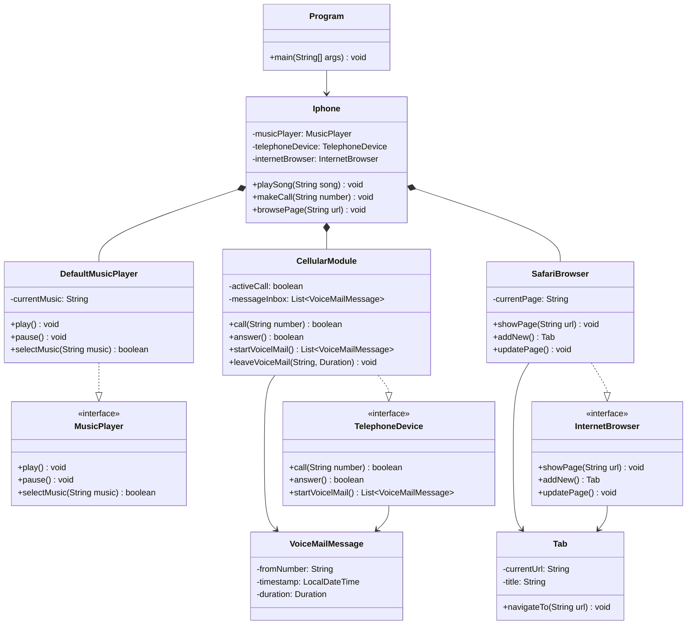

# Projeto iPhone: Modelagem, Diagramação e Funcionalidades em Java

Este projeto é uma aplicação de console em Java que implementa as funcionalidades básicas de um iPhone. Nascido a partir de um exercício de design, o projeto evoluiu de uma modelagem UML detalhada para uma implementação completa que demonstra conceitos importantes de Arquitetura de Software e Design Orientado a Objetos.

---

## ✨ Funcionalidades

O projeto implementa três funcionalidades principais de um iPhone:

- **Reprodutor Musical:** Permite selecionar uma música, tocar e pausar.
- **Aparelho Telefônico:** Permite fazer chamadas, atender e acessar uma caixa de correio de voz que armazena mensagens em memória.
- **Navegador na Internet:** Permite exibir uma página, atualizar e adicionar novas abas.

---

## 🧠 Arquitetura e Conceitos Aplicados

Este projeto não é apenas uma simulação, mas um estudo de caso prático da aplicação dos seguintes princípios de engenharia de software:

- **Modelagem UML e Arquitetura de Software:** Todo o projeto foi planejado e arquitetado através de um diagrama de classes UML antes da escrita do código. O diagrama serviu como um *blueprint*, definindo as classes, interfaces, seus relacionamentos (Composição, Implementação, Dependência) e os contratos dos métodos, guiando todo o desenvolvimento.
- **Programação Orientada a Objetos (POO):** Uso de classes, objetos, encapsulamento и polimorfismo como base de toda a estrutura.
- **Design Orientado a Interfaces:** A aplicação é programada para interfaces (`MusicPlayer`, `TelephoneDevice`, etc.), não para implementações concretas, promovendo baixo acoplamento e alta flexibilidade.
- **Padrão de Projeto - Composição sobre Herança:** A classe `Iphone` é composta por seus componentes (`CellularModule`, `SafariBrowser`, etc.), evitando o problema da "classe Deus" e promovendo a reutilização de código.
- **Padrão de Projeto - Fachada (Facade):** A classe `Iphone` atua como uma fachada, fornecendo uma interface simples e unificada para o sistema complexo de componentes internos.
- **Princípio da Responsabilidade Única (SRP):** Cada classe tem um propósito claro e bem definido.
- **Organização de Pacotes:** O código é estruturado em pacotes (`application`, `entities`, `services`) que separam as responsabilidades arquiteturais do projeto.

---

## 🏛️ Estrutura do Projeto

O projeto está organizado na seguinte estrutura de pacotes:

/src
├── application
│   └── Program.java         # Ponto de entrada e menu interativo
├── entities
│   ├── Iphone.java          # Classe Facade que representa o dispositivo
│   └── components           # Implementações concretas das funcionalidades
│       ├── CellularModule.java
│       ├── DefaultMusicPlayer.java
│       └── SafariBrowser.java
└── services                 # Contratos (interfaces) e modelos de dados
├── InternetBrowser.java
├── MusicPlayer.java
├── Tab.java
├── TelephoneDevice.java
└── VoiceMailMessage.java

---

## 📊 Diagrama UML do Projeto

A arquitetura final do sistema foi modelada em UML e pode ser visualizada de forma interativa através do link abaixo.

**Ver Diagrama Interativo:** [https://www.mermaidchart.com/app/projects/99e6f5f4-f33e-40db-a611-a1fb662de9b2/diagrams/19623c79-a913-45c5-881e-ee9efc34102b/version/v0.1/edit](https://www.mermaidchart.com/app/projects/99e6f5f4-f33e-40db-a611-a1fb662de9b2/diagrams/19623c79-a913-45c5-881e-ee9efc34102b/version/v0.1/edit)

## 👨‍💻 Autor

**João Victor Firmino Sousa**

* **LinkedIn:** [João Victor Firmino Sousa](https://www.linkedin.com/in/jo%C3%A3o-victor-firmino-sousa-130874208/)
* **GitHub:** [@joaofvic](https://github.com/joaofvic)
